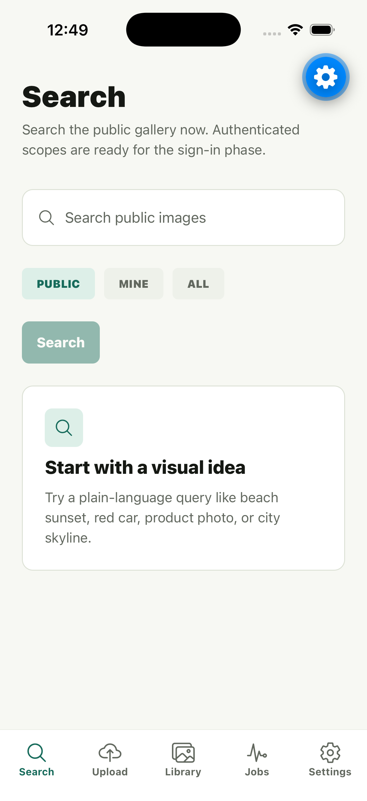
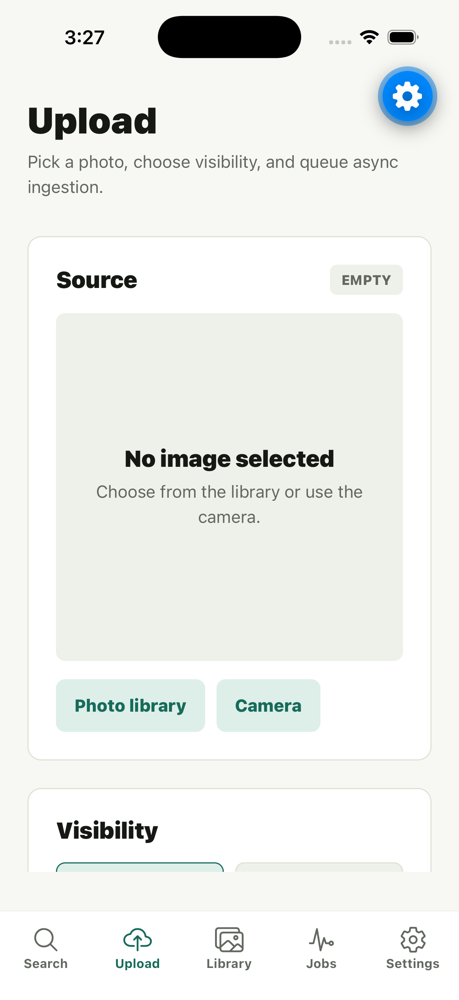
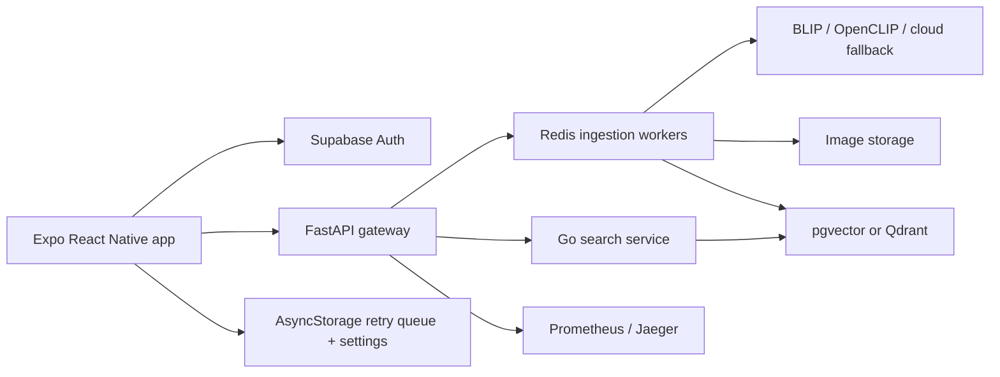

# Mobile Companion Reviewer Guide

This guide is the short path for reviewing the React Native / Expo companion app without reading the full backend codebase.

The app is intentionally thin: it owns native mobile UX, Supabase session handling, upload form state, local retry metadata, network awareness, and query caching. The existing FastAPI gateway, workers, Go search service, vector store, and storage layer remain the source of truth.

## Screenshots

<p>
  
  
</p>

## Architecture



Mobile responsibilities:

- Supabase sign-in/sign-up and bearer-token forwarding.
- Public, mine, and all search scopes through the existing API.
- Camera/photo-library selection with React Native `FormData` upload.
- Async ingestion job tracking with local recent-job history.
- Offline-aware retry state, paused polling, and stale cached search messaging.
- Owner library browsing, visibility updates, soft delete, and image detail.

Backend responsibilities:

- Multi-tenant auth enforcement and image ownership.
- Async ingestion orchestration through Redis workers.
- Captioning, embedding, local/cloud routing policy, and storage.
- Hybrid search through the Python API or Go read service.
- Metrics, traces, and production deployment.

## Demo Script

Target length: 90-120 seconds.

1. Start the backend and Expo app.
2. Open Search and query a public phrase such as `beach sunset`.
3. Point out score, visibility, and caption-origin metadata on result cards when present.
4. Sign in with Supabase.
5. Open Upload, choose Photo library or Camera, set visibility, and submit.
6. Open Jobs and show queued/processing/completed states.
7. Open the completed image detail screen.
8. Search `mine` for a term from the generated caption.
9. Toggle network offline or stop the backend to show cached/offline messaging.
10. Show this architecture diagram and explain that mobile is a native client for the AI routing backend.

Suggested narration:

> The mobile app is production-shaped but intentionally thin. It handles native image selection, Supabase auth, network state, async job polling, local retry state, and mobile-friendly image management while the existing backend owns caption routing, embeddings, storage, and hybrid retrieval.

## Smoke Test Commands

```bash
cd apps/mobile
source ~/.nvm/nvm.sh
nvm use 24.11.1
npm install
npm run typecheck
npm run lint
npx expo start
```

iOS Simulator, when Xcode is installed:

```bash
cd apps/mobile
source ~/.nvm/nvm.sh
nvm use 24.11.1
DEVELOPER_DIR=/Applications/Xcode.app/Contents/Developer \
REACT_NATIVE_PACKAGER_HOSTNAME=$(ipconfig getifaddr en0) \
npx expo start --ios --host lan
```

## Manual QA Checklist

- [ ] App starts in Expo Go or iOS Simulator.
- [ ] Anonymous user can search public images.
- [ ] Anonymous user sees auth-required states for Upload, Library, and Jobs.
- [ ] User can sign in and sign out with Supabase.
- [ ] Settings `Check backend health` reaches the intended API base URL.
- [ ] Settings `Check auth` is accepted when signed in.
- [ ] User can choose an image from the photo library.
- [ ] User can launch the camera flow on a device with camera support.
- [ ] Upload submits to `POST /images/async?priority=normal`.
- [ ] Jobs screen shows queued, processing, completed, failed, and retry-pending states as applicable.
- [ ] Completed job opens image detail.
- [ ] Library shows the signed-in user's images and filters all/private/public.
- [ ] Visibility update persists through `PATCH /images/{id}`.
- [ ] Delete removes the image from the mobile library.
- [ ] Offline mode shows the app-level banner.
- [ ] Offline upload saves a retry-pending local job.
- [ ] Job polling and retry actions pause while offline.
- [ ] Cached search results are labeled as offline/stale.
- [ ] Settings can clear the local job queue.
- [ ] Settings can clear the query cache.

## Known Review Notes

- Expo Go screenshots may show Expo's floating development control. A production build or development build should not use those screenshots as App Store media.
- Physical-device testing needs the API base URL set to the Mac LAN address, not `localhost`.
- Android emulator testing should use `http://10.0.2.2:8000` for the local backend.
- The mobile app does not include service-role Supabase keys, database URLs, provider API keys, or storage secrets.
