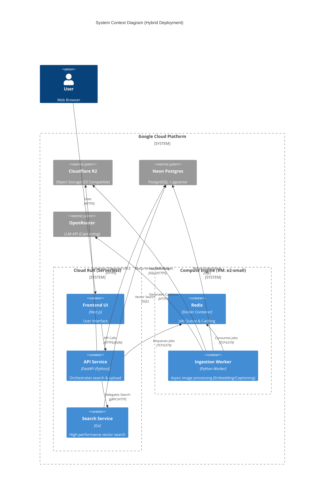

# System Architecture

This document describes the high-level architecture of the AI Image Search application, specifically focusing on the **Hybrid Cloud Deployment** model used to optimize costs while maintaining scalability.

## Hybrid Deployment Architecture

We utilize a hybrid approach combining **Google Cloud Run** (serverless) for stateless services and **Google Compute Engine** (VM) for stateful/background components.

## Component Details

### 1. API Service (Cloud Run)
-   **Technology:** Python, FastAPI.
-   **Role:** Main entry point. Handles auth, upload coordination, and search orchestration.
-   **Scaling:** Scales to zero. Autoscales based on request volume.
-   **Configuration:** `USE_REAL_EMBEDDER=true` (CPU-optimized), `USE_REAL_CAPTIONER=false` (Delegates to Cloud/Mock).

### 2. Search Service (Cloud Run)
-   **Technology:** Go.
-   **Role:** Dedicated microservice for low-latency vector search.
-   **Scaling:** Scales to zero.

### 3. Ingestion Worker (Compute Engine)
-   **Technology:** Python.
-   **Role:** Background processing.
    -   Downloads images.
    -   Generates embeddings (using local Torch/OpenCLIP).
    -   Generates captions (using OpenRouter or Mock).
    -   Stores results in Postgres (pgvector).
-   **Infrastructure:** Runs as a Docker container on a single `e2-small` VM to save costs (vs. always-on Cloud Run).

### 4. Redis (Compute Engine)
-   **Technology:** Redis 7.
-   **Role:** Message broker for Celery/Task queue.
-   **Infrastructure:** Docker container on the same VM as the worker. Exposed via public IP (password protected) to allow Cloud Run access without expensive VPC Connectors.

### 5. Storage & Database
-   **Cloudflare R2:** Cheap, S3-compatible object storage for raw images.
-   **Neon Postgres:** Serverless PostgreSQL with `pgvector` extension for vector similarity search.
